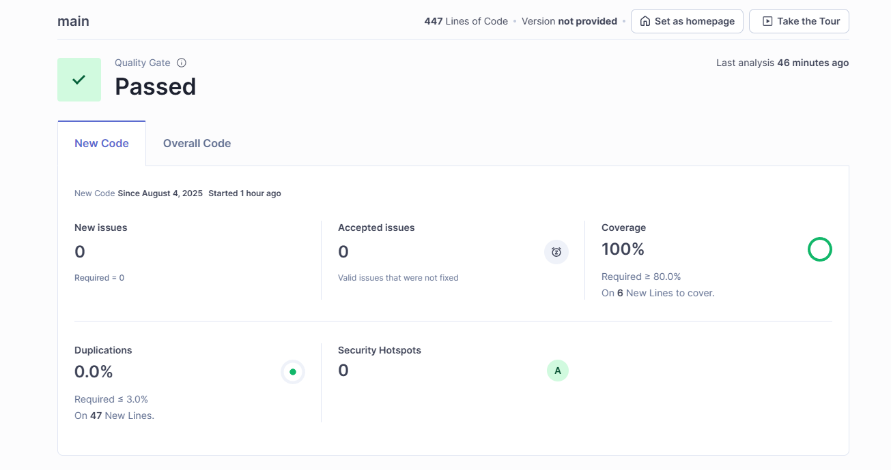

# CorePlatform - Price API

Este proyecto implementa una **API REST** en **Spring Boot** para consultar el precio aplicable de un producto en una fecha concreta para una marca específica, basado en una tabla `PRICES` simulada en base de datos **H2** en memoria. Está preparado para facilitar su despliegue mediante contenedores Docker.

---

## 📌 Descripción funcional

La base de datos contiene una tabla `PRICES` que refleja el precio final (**PVP**) y la tarifa aplicable a un producto para una marca dentro de un rango de fechas.

El servicio REST acepta como **parámetros de entrada**:
- `applicationDate`: Fecha y hora de aplicación (formato ISO LocalDateTime).
- `productId`: Identificador de producto.
- `brandId`: Identificador de marca o cadena.

Y devuelve como **datos de salida**:
- Identificador de producto.
- Identificador de marca.
- Tarifa aplicada (`priceList`).
- Rango de fechas de aplicación (`startDate`, `endDate`).
- Precio final (`price`).
- Moneda (`curr`).

Si hay múltiples tarifas aplicables, se selecciona la de **mayor prioridad** (`priority`).

---

## 🧱 Arquitectura del proyecto

El proyecto sigue los principios de **arquitectura hexagonal**:

- **Dominio**: Reglas de negocio representadas por entidades, modelos y puertos.
- **Aplicación**: Casos de uso que orquestan el dominio.
- **Infraestructura**: Adaptadores como controladores REST, mapeadores JPA y acceso a base de datos.

Además:
- 🧼 **Principios SOLID** en todas las capas.
- ✅ **Desarrollo dirigido por tests (TDD)**.
- 🌐 API documentada vía **OpenAPI 3** y expuesta con **Swagger UI**.
- 🥪 Tests **unitarios**, **de integración** y **end-to-end**.
- 🐳 Preparado para **despliegue con Docker**.

---

## 🛠️ Tecnologías utilizadas

- Java 21
- Spring Boot 3.4+
- Maven 3.9+
- H2 Database (en memoria)
- JUnit 5 + RestAssured
- Swagger/OpenAPI
- Docker
- SonarQube (calidad de código)
- Postman (colección de pruebas)

---

## 💄 Base de datos

- Motor: **H2** (modo memoria).
- Script de datos: `data.sql`.

Ejemplo de tabla `PRICES`:

| BRAND_ID | START_DATE          | END_DATE            | PRICE_LIST | PRODUCT_ID | PRIORITY | PRICE | CURR |
|----------|---------------------|---------------------|------------|------------|----------|-------|------|
| 1        | 2020-06-14 00:00:00 | 2020-12-31 23:59:59 | 1          | 35455      | 0        | 35.50 | EUR  |
| 1        | 2020-06-14 15:00:00 | 2020-06-14 18:30:00 | 2          | 35455      | 1        | 25.45 | EUR  |
| 1        | 2020-06-15 00:00:00 | 2020-06-15 11:00:00 | 3          | 35455      | 1        | 30.50 | EUR  |
| 1        | 2020-06-15 16:00:00 | 2020-12-31 23:59:59 | 4          | 35455      | 1        | 38.95 | EUR  |

---

## 🚀 Cómo ejecutar la aplicación

### Requisitos previos

- Java 21
- Maven 3.9+
- Docker (opcional, pero recomendado)

### Opción 1: Ejecutar localmente

```bash
mvn clean spring-boot:run
```

Accede a:
```
http://localhost:8080
```

### Opción 2: Ejecutar con Docker

```bash
docker build -t price-api .
docker run -p 8080:8080 price-api
```

---

## 🔗 Endpoints REST

### GET `/api/prices`

**Parámetros de consulta:**
- `applicationDate` → Fecha y hora de aplicación
- `productId` → ID de producto
- `brandId` → ID de marca

Ejemplo:
```
GET http://localhost:8080/api/prices?applicationDate=2020-06-14T16:00:00&productId=35455&brandId=1
```

Respuesta:
```json
{
  "productId": 35455,
  "brandId": 1,
  "priceList": 2,
  "startDate": "2020-06-14T15:00:00",
  "endDate": "2020-06-14T18:30:00",
  "price": 25.45,
  "curr": "EUR"
}
```

En caso de error, se devuelve un **404 Not Found** con mensaje.

---

## 📁 Documentación OpenAPI

- Swagger UI disponible en:  
  [http://localhost:8080/swagger-ui/index.html](http://localhost:8080/swagger-ui/index.html)
- Archivo OpenAPI:  
  `src/main/resources/static/openapi.yaml`

---

## 🧪 Pruebas con Postman

En el repositorio se incluye el archivo **`Pruebas_Postman.json`**, que contiene una colección de peticiones para **Postman** con los casos de prueba planteados.  
Para usarla:
1. Abre Postman.
2. Importa el archivo `Pruebas_Postman.json`.
3. Ejecuta los requests para verificar el comportamiento de la API.

---

## ⚠️ Gestión de errores global

La clase `GlobalExceptionHandler` captura errores comunes y devuelve respuestas normalizadas (`ErrorResponseDTO`) con:
- Código HTTP
- Mensaje legible
- Marca temporal (`timestamp`)

---

## ✅ Tests automáticos

Incluye:
- Tests **unitarios** para lógica de dominio y casos de uso.
- Tests **E2E** con `RestAssured` para 5 escenarios:

| Test | applicationDate             | Tarifa esperada |
|------|-----------------------------|-----------------|
| 1    | `2020-06-14T10:00:00`       | Tarifa 1        |
| 2    | `2020-06-14T16:00:00`       | Tarifa 2        |
| 3    | `2020-06-14T21:00:00`       | Tarifa 1        |
| 4    | `2020-06-15T10:00:00`       | Tarifa 3        |
| 5    | `2020-06-16T21:00:00`       | Tarifa 4        |

Para ejecutarlos:
```bash
mvn clean test
```

---

## 🧽 Calidad del código

- Analizado con **SonarQube**:
  - Seguridad: ✅
  - Fiabilidad: ✅
  - Mantenibilidad: 🟢
  - Cobertura de tests: Medida con **JaCoCo**

---
## Prueba Sonar


---
## 📝 Notas finales

✔️ Arquitectura limpia, mantenible y extensible.  
✔️ Lista para CI/CD mediante contenedores.  
✔️ Cumple principios de Clean Code y buenas prácticas Java.

